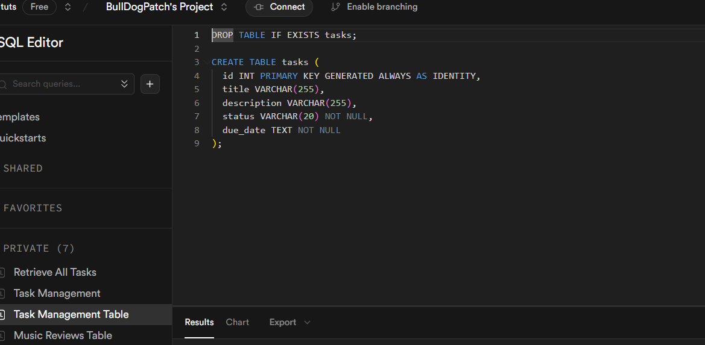
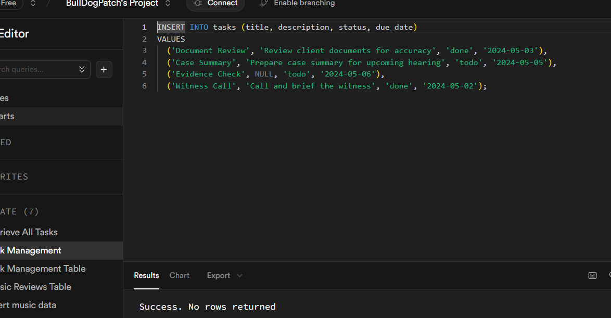

#### Frontend

- React
- React-router
- Tanstack Query

#### Backend

- Express
- Postgres

#### Database

- Supabase

## Todo

- Format date when task submitted ✅
- Be able to delete a task ✅
- Be able to update a task ✅
- Style app ✅




# Task Management Front End - Endpoints

Base URL: `https://technical-test1.netlify.app`

Tasks status can be edited on `/task/:id`

---

### `GET /`

Retrieve all tasks.

---

### `GET /tasks/:id`

Retrieve a single task by ID.

- **Params**:  
  `id` – integer (task ID)

---

### `POST /create`

Create a new task.

---

# 📘 Task Management API – Endpoints

#### Please allow 30 seconds for the server on Render to spin up.

Base URL: `https://techinal-test.onrender.com`

---

### `GET /tasks`

Retrieve all tasks.

---

### `GET /tasks/:id`

Retrieve a single task by ID.

- **Params**:  
  `id` – integer (task ID)

---

### `POST /create-task`

Create a new task.

- **Body**:
  ```json
  {
    "title": "Task title",
    "description": "Optional description",
    "status": "todo | in-progress | done",
    "due_date": "YYYY-MM-DD"
  }
  ```

---

### `PUT /tasks/:id`

Update a full task by ID.

- **Params**:  
  `id` – integer (task ID)

- **Body**:
  ```json
  {
    "title": "Updated title",
    "description": "Updated description",
    "status": "done",
    "due_date": "YYYY-MM-DD"
  }
  ```

---

### `PATCH /task/:id/status`

Update only the status of a task.

- **Params**:  
  `id` – integer (task ID)

- **Body**:
  ```json
  {
    "status": "todo | in-progress | done"
  }
  ```

---

### `DELETE /tasks/:id`

Delete a task by ID.

- **Params**:  
  `id` – integer (task ID)
